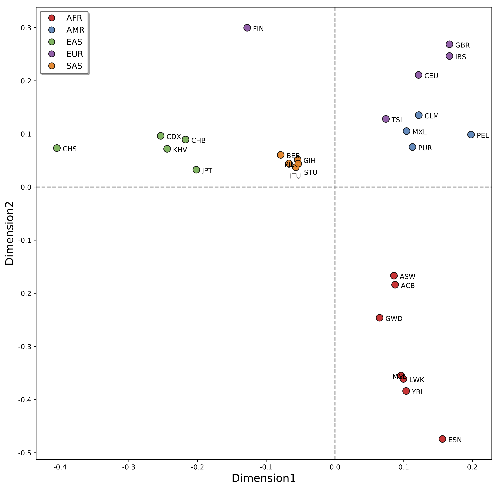

#  Y-LineageTracker Manual

<li>[1 Introduction](#1-introduction)  
<li>[2 Dependencies and Installation](#2-dependencies-and-installation)  
&nbsp;&nbsp;&nbsp;&nbsp;&nbsp;&nbsp;[2.1 Dependencies](#21-dependencies)  
&nbsp;&nbsp;&nbsp;&nbsp;&nbsp;&nbsp;[2.2 Installation](#22-installation)  
&nbsp;&nbsp;&nbsp;&nbsp;&nbsp;&nbsp;[2.3 Testing](#23-testing)  
&nbsp;&nbsp;&nbsp;&nbsp;&nbsp;&nbsp;[2.4 Usage](#24-usage)  
<li>[3 Commands and Options](#3-commands-and-options)  
<li>[4 Examples](#4-examples)  
&nbsp;&nbsp;&nbsp;&nbsp;&nbsp;&nbsp;[4.1 Input Files](#41-input-files)  
&nbsp;&nbsp;&nbsp;&nbsp;&nbsp;&nbsp;[4.2 Example Usages and Output Files](#42-example-usages-and-output-files)  
<li>[5 Contacts](#5-contacts)  
<li>[6 References](#6-references)  

## 1 Introduction
 
Due to haploid and male-specific, the human Y-chromosome plays a crucial role to understand human evolution and genetics. The single-nucleotide polymorphisms (SNPs) and short tandem repeats (STRs) on the NRY are always regarded as significant markers to trace direct paternal ancestral lines and reflect the peculiarities of past male behaviors. In particular, with the increasing popularity of next-generation sequencing (NGS) platforms in recent years, the NRY has provided researchers increasingly informative markers to track human paternal lineages.  
  
However, there is a lack of a specific tool or analysis pipeline to combine data and analysis methods of Y-SNPs and Y-STRs to infer paternal lineage from Y-chromosome sequencing data. To solve such a problem, we developed Y-LineageTracker, a framework to fully analyze human Y-chromosome sequencing data from paternal level.  

Y-LineageTracker will make use of Y-chromosome sequencing data to a great extent, and perform subsequent analyses for NRY haplogroups and Y-STRs. Most basic analyses for human Y-chromosome are supported, it can:  

1. Classify NRY haplogroups from BAM or VCF.  
2. Perform clustering analysis and phylogeny analysis for NRY haplogroups.  
3. Genotype Y-STRs from BAM or VCF indels.  
4. Perform statistical analysis and network analysis for Y-STR haplotype data.  
5. Estimate divergence time of NRY haplogroups.
6. Estimate TMRCA of Y-STR haplotypes.  

Y-LineageTracker is written in python3, it can be used by command line under Windows, Linux and MacOS platform. For details on usages and examples, see below.

## 2 Dependencies and Installation
### 2.1 Dependencies

* **Software:**  
Python3.6 or above, see <http://www.python.org>     

* **Python Packages:**  
 
**pandas**, see <https://pandas.pydata.org> This package is used for reading, processing, and analyzing data.  
**numpy**, see <https://numpy.org> This package is used for scientific computation in different analyses.  
**sklearn**, see <https://scikit-learn.org> This package is applied for clustering and classification algorithms.  
**scipy**, see <https://www.scipy.org/> This package is used for alignment algorithms.  
**matplotlib**, see <http://matplotlib.org> PaternalTracker uses this package to visualize haplotype network and haplogroup clustering results.  
**ete3**, see <http://etetoolkit.org> This package is used to work with phylogenetic tree data.  
**networkx**, see <https://networkx.github.io> This package is used for calculation and visualization of the haplotype network.  
**pygraphviz**, see <http://pygraphviz.github.io/documentation/pygraphviz-1.5> This package is used to set the layout of the network.  
**BioPython**, see <https://biopython.org> This package is mainly used to support input and output files in different formats.  
**pysam**, see <https://pysam.readthedocs.io/en/latest> This package is mainly used to fetch reads from BAM files.  
**adjustText**, see <https://github.com/Phlya/adjustText> This package is used to annotate populations in the plot of clustering analysis.

### 2.2 Installation
We recommended installing Y-LineageTracker from **PyPI**:  
	
	$ pip install Y-LineageTracker  
	
You can also download source code at:  
<https://www.picb.ac.cn/PGG/resource.php>  

To download and decompress the source code, you can change directory to the source code folder and run:

	$ python3 setup.py build
	$ python3 setup.py install
	
### 2.3 Testing
To check if everything is running correctly, you can type and run the following command:

	$ LineageTracker test
	
Alternatively, you can download the source code and type:

	$ python3 setup.py test

### 2.4 Usage
The basic usage of Y-LineageTracker is:

	$ LineageTracker <subcommand> [options]

To see how to use Y-LineageTracker, you can type the following command for help:  
	
	$ LineageTracker --help # see overall help massages
	$ LineageTracker <subcommand> --help # see help massages of a specific subcommand
	
To see the version of Y-LineageTracker:  
	
	$ LineageTracker --version 

## 3 Commands and Options
### <a name="classify"> LineageTracker classify [OPTIONS] </a>

 
This command will classify NRY haplogroup and construct the lineage of each individual based on the ISOGG NRY tree. VCF or BAM format is supported for NRY haplogroup classification.

 
**Input options:**  
**--vcf [file]**  
Take VCF as input file, only one VCF is required for this command (see Example 4.1.1).  
**--bam [file]**  
Take BAMs or a list of BAM files for analysis (see Example 4.1.2). For example, multiple BAMs can be as input:    
`--bam ind1.bam –bam ind2.bam … --bam ind10.bam` or `-–bam bam_list.txt`.  
 

 
**General options:**  
**-s, --sample [file]**  
Optional, a list containing all individuals used for NRY haplogroup classification (see Example 4.1.3).  
**-b, --build [37, 38, Ref]**  
Required, the build version of the reference genome used for NRY haplogroup classification.  
**--filter / ---filter [float] / --filter auto**  
Optional, filter female individuals by setting a cutoff of missing rate, the sample with a missing rate value greater than this value will be filtered. The default value is 0.75. If the optimal missing rate value is unknown, you can set the **auto** parameter to filter female individuals automatically.  
**--chip**  
Optional, declare the input data is SNP-array. This option is only used for the VCF file.  
**--snp-only**  
Optional, classify NRY haplogroups only from SNP data. This option is only used for the VCF file.  
**--mut-info**  
Optional, output all matched haplogroup mutations of each individual.  
**-a, --approximate**  
Optional, classify NRY haplogroups which are in uncertain tree branches.  
**--phylo**  
Optional, construct a phylogenetic tree based on NRY haplogroup classification results.This option is only used for the VCF file.  
**--ref [file]**  
Optional, customize the file of haplogorup markers in classification analysis.  
**-o, --output**  
Optional, the prefix of output files.  
**-h, --help**  
Print help messages.  
 
 

### <a name="cluster">LineageTracker cluster [OPTIONS]</a>

 
Perform the clustering analysis based on NRY haplogroup results to show population structure. Clustering method can be applied by the `--method` option.
 

 
**--hg [file]**  
Required, a file containing sample ID and haplogroup of each individual (see Example 4.1.4).  
**-p, --population [file]**  
Required, a file containing sample ID and population information of each individual (see Example 4.1.7).  
**--method [pca, mds]**  
Optional, the algorithm used for clustering analysis. If the clustering algorithm is PCA, the program will output eigenvectors and eigenvalues; if it is MDS, the program will output pairwise Fst of populations and embedding file. The default is PCA.  
**--level [int] / --level min / --level auto **  
Optional, the haplogroup resolution level of NRY haplogroups for clustering, which means the degree of similarity among haplogroups in the same main trunk. The parameter **auto** will set an optimal level to simplify NRY haplogroups resolution.  
**--freq**  
Optional, output the haplogroup frequency of each population.  
**-o, --output**  
Optional, the prefix of output files.   
**-h, --help**  
Print help messages. 

 

### <a name="phylo">LineageTracker phylo [OPTIONS]</a>

 
Perform phylogeny analysis based on NRY haplogroups. It is recommended to input both haplogroup file and sequence alignment file to construct a bifurcating tree. If only the haplogroup file is given, the phylogenetic tree may contain polytomies (a node with more than two children).

 
**--hg [file]**  
Required, a file containing sample ID and haplogroup of each individual (see Example 4.1.4).  
**--seq [file]**  
Optional, sequence alignment file (see Example 4.1.5).  
**--seq-format [fasta, phylip, nexus, meg, vcf]**  
Required, the file format of sequence alignment file. The default is fasta.  
**-p, --population [file]**  
Optional, a file containing sample ID and population information of each individual (see Example 4.1.7).  
**--align-method [mp, ibs, upgma]**  
Optional, the method of constructing the bifurcating tree from multiple sequences, **mp** means maximum parsimony. The default is mp.  
**--tree-format [newick, nexus, phyloxml, nexml]**  
Optional, the file format of output phylogenetic tree. The default is newick.  
**--layout [rectangular, circular]**  
Optional, the layout of the phylogenetic tree in figure. The default is rectangular.  
**-o, --output**  
Optional, the prefix of output files.  
**-h, --help**  
Print help messages. 
  
 

### <a name="genostr">LineageTracker genostr [OPTIONS]</a>

 
Genotype Y-STRs from BAM or VCF indels. The program will genotype Y-STR alleles from input files. Different Y-STR panels are supported in this command and can be selected by the `–-panel` option. 

 
**Input options:**  
**--vcf [file]**  
Take VCF as input file, only one VCF is required for this command (see Example 4.1.1).  
**--bam [file]**  
Take BAMs or a list of BAM files for analysis (see Example 4.1.2). For example, multiple BAMs can be as input:  
`--bam ind1.bam –bam ind2.bam … --bam ind10.bam` or `-–bam bam_list.txt`.  

 
**General options:**  
**-s, --sample [file]**  
Optional, a list containing all individuals used for Y-STR genotyping (see Example 4.1.3).  
**-b, --build [37, 38]**  
Required, the build version of the reference genome used for Y-STR genotyping. The default is 37.  
**---filter [float] / --filter / --filter auto**  
Optional, filter female individuals by setting a cutoff of missing rate, the sample with a missing rate value greater than this value will be filterd. The default value is 0.75. If the optimal missing rate value is unknown, you can set the **auto** parameter to filter female individuals automatically.  
**--panel [named, all, minimal, ppy, ppy23, yf]**  
Optional, the set of Y-STR loci for genotyping. These sets are referenced from all possible Y-STRs, named Y-STRs and commonly used STR multiplex kit, such as Minimal, PowerPlex Y, PowerPlex 23, Yfiler. The default is named.  
**-o, --output**  
Optional, the prefix of output files.  
**-h, --help**  
Print help messages.  
  
 
	
### <a name="stat">LineageTracker stat [OPTIONS]</a>

 
Perform statistical analysis for Y-STR haplotype data. Y-LineageTracker has built-in common genetic statistical methods used in Y-chromosome analysis. Note that Y-STR haplotype only supports data in the matrix format.

 
**Input options:**  
**--seq [file]**  
Haplotype data in sequence alignment format (see Example 4.1.5).  
**--matrix [file]**  
Y-STR haplotype data in matrix format (see Example 4.1.6).  

 
**General options:**  
**--seq-format [fasta, phylip, nexus, meg, vcf]**  
The format of sequence alignment file. This option is only required for the sequence alignment file.  
**-p, --population [file]**  
A file containing sample ID and population information of each individual (see Example 4.1.7). The population file is required in the analysis of calculating statistics, but not in the haplogroup prediction.  
**--gd [fst, rst, Ngst, NCgst, Hgst]**  
Optional, calculate genetic distance based on the selected statistics.  
**--amova / --amova [fst, rst]**  
Optional, obtain the AMOVA table and calculate Fst or Rst of pairwise populations based on AMOVA and give the *p* values. The default is fst.  
**--hd**  
Optional, calculate haplotype diversity of each population.  
**--mpd**  
Optional, calculate mean pairwise distance within and between populations.  
**--predict**  
Optional, predict possible NRY haplogroups and give the probability of each haplogroup from Y-STR haplotype data by Bayesian approach. This analysis only supports Y-STR haplotype data.  
**-o, --output**  
Optional, the prefix of output files.  
**-h, --help**  
Print help messages.  

 

### <a name="net">LineageTracker net [OPTIONS]</a>

Perform network analysis for Y-STR haplotype data. Network analysis can show the evolutionary relationship between haplotypes. This command can output network figure, and fdi file, which can directly be as input file of Network software (www.fluxus-engineering.com) to show network plot and estimate time.

 
**Input options:**  
**--seq [file]**  
Haplotype data in sequence alignment format (see Example 4.1.5).  
**--matrix [file]**  
Y-STR haplotype data in matrix format (see Example 4.1.6).  

 
**General options:** 
**--seq-format [fasta, phylip, nexus, meg, vcf]**  
The format of sequence alignment file. This option is only required for the sequence alignment file.  
**-p, --population [file]**  
Optional, A file containing sample ID and population information of each individual (see Example 4.1.7). If the population file is provided, the network node will be a pie to show the proportion of the population in the haplotype.  
**--filter [float]**  
Optional, the cutoff value of the site to be filtered, sites with a missing rate value greater than this value will be filtered  
**--treetype [mjn, msn]**  
Optional, the algorithm used to construct a network tree. It can be mjn (median-joining network) or msn (minimum spanning network). The default is mjn.  
**--gap [allele, missing]**  
Optional, the gap coding method. You can choose to code gaps as a new type of allele or missing data.  
**--search [int]**  
Optional, How the search for new median nodes is performed: the larger this parameter, the wider the search.  
**--fdi**  
Optional, output fdi file that can be used as the input file in Network software, to show network plot or estimate TMRCA directly.  
**--alt [hide, show, dashed]**  
Optional, whether to show alternative links between nodes in the network figure.  
**--mediansize [float]**  
Optional, the median node size in the median-joining network compared to base size in the network figure. The default is 0.  
**--equalsize**  
Optional, keep all nodes the same size in the network figure.  
**-o, --output**  
Optional, the prefix of output files.  
**-h, --help**  
Print help messages.  

 

### <a name="time">LineageTracker time [OPTIONS]</a>

Estimate divergence time of NRY haplogroups. PAML mcmctree is wrapped in Y-LineageTracker to run time estimation analysis by Bayesian MCMC algorithm. The tree file containing haplogroup nodes can be generated by ***phylo*** command.

**--seq [file]**  
Required, the sequence alignment file used for analysis (see Example 4.1.5).  
**--seq-format [fasta, phylip, nexus, meg, vcf]**  
Optional, the format of sequence alignment file.  
**--tree [file]**  
Required, tree file of NRY phylogeny (see Example 4.1.8). The tree should be a rooted bifurcating tree without branch length. It is recommended to annotate NRY haplogroup name in tree nodes.   
**--cal [file] / --cal HAPLOGROUP:CALIBRATION**  
Optional, haplogroup calibration information. This information can be added by the `--cal` option or providing a list file (see Example 4.1.9). For example, multiple calibrations can be added by:  
`--cal CF:69000-73000, --cal C:<53000 ...` or `--cal calibration_list.txt`.  
**--model [hky85, jc96, k88, f81, f84, gtr]**  
Optional, the substitution model used for time estimation. The default is hky85.  
**--mut-rate [float]**  
Optional, the general mutation rate across the NRY. The default value is 7.6e-10 (per generation per site).  
**--auto-cal**  
Optional, automatically set calibration information for the root node. In order to make this option feasible, the root node should be a haplogroup in the main trunk of the NRY tree.  
**--filter [float]**  
Optional, filter sites with a missing rate value greater than a value in sequence alignment file.  
**--mcmc [int]**  
Optional, set iteration step to run MCMC. The default is 5000.  
**-o, --output**  
Optional, the prefix of output files.  
**-h, --help**  
Print help messages.  

 

### <a name="tmrca">LineageTracker tmrca [OPTIONS]</a>

Estimate TMRCA for Y-STR haplotypes. Network information file or sequence alignment file is supported to estimate TMRCA. The program will calculate rho statistics from network information file, or calculate ASD statistics from the sequence alignment file, and to estimate TMRCA based on the statistics.

**Input options:**  
**--net [file]**  
Network information file (see Example 4.1.10).  
**--matrix [file]**  
Y-STR haplotype data in matrix format (see Example 4.1.6).  

**General options:**  
**--anc-des [file] / anc-des ANCESTOR:DESCENDANT1,DESCENDANT2,...**  
Required, information of ancestor and descendants. The program will estimate the time based on mutations from the ancestor to each descendant. This information can be added by the `--anc-des` option or providing a list file (see Example 4.1.11). For example, multiple TMRCA can be estimated by:  
`--anc-des ind1:ind2,ind3 --anc-des ind2:ind3,ind4,ind5 ...` or `--anc-des ad_list.txt`.  
**-p, --population [file]**  
Optional, a file containing sample ID and population information of each individual (see Example 4.1.7). This option is only used for matrix file.  
**--mut-rate**  
Optional, the general mutation rate across Y-STR haplotype. The default value is 6e-3 (per generation per locus).  
**--generation**  
Optional, the generation time used for time estimation. The default value is 30 (y).  
**-o, --output**  
Optional, the prefix of output files.  
**-h, --help**  
Print help messages.  

## 4 Examples
### 4.1 Input Files
#### 4.1.1 Variant Call Format File (file.vcf / file.vcf.gz)

Variant Call Format (VCF) is a text file format containing information about position and genotype of each sample in the genome, see <https://samtools.github.io/hts-specs/VCFv4.2.pdf>  
VCF files can be as input by the `–-vcf` option and only one VCF is required for analysis. For the situation with multiple VCF files, you can merge them by VCFtools or BCFtools.

#### 4.1.2 Binary Alignment Map File (file.bam)

Binary Alignment Map (BAM) is a binary file format used to represent aligned sequences information. More details about BAM format are described at <https://samtools.github.io/hts-specs/SAMv1.pdf>  
BAM files can be as input by –-bam option. Multiple BAM files can be as input by adding `-–bam` option or providing a list of bam files, for example: `--bam ind1.bam –-bam ind2.bam … --bam ind10.bam` or `–-bam bam_list.txt`.

#### 4.1.3 Sample File

Sample list contains individuals used for NRY haplogroup classification or Y-STR genotyping, which can be as input by `-s` or `--sample` option. As shown in the following example, the sample list file has no header, and each line is the sample ID of an individual to be analyzed.

	HG00403
	HG00406
	...
	NA12889

#### 4.1.4 Haplogroup File (file.hg)

As shown in the following example, haplogroup file contains sample ID and NRY haplogroup of each individual. Header containing **SampleID** and **Haplogroup** is required. Haplogroup file can be generated by ***classify*** command and is required for clustering and phylogeny analysis in Y-LineageTracker.  

	
	SampleID	Haplogroup
	HG00403		O2a1b1a1a1a1f2b
	HG00406		O1b1a2c
	...
	NA12889		R1b1a1b1a1a2e2
	
#### 4.1.5 Sequence Alignment File

Y-LineageTracker supports various commonly used sequence alignment formats as input sequence alignment files, such as fasta, phylip, nexus, meg and vcf. File format can be specified by the `--seq-format` option.

	

#### 4.1.6 Matrix File (file.matrix)

The matrix file format is a self-defined format in Y-LineageTrcaker. Matrix file can be generated by ***genostr*** command and used for haplotype analysis. File in matrix format contains **SampleID** and name of each Y-STR locus. For example, a matrix file is like:

	SampleID	DYS19	DYS385a		...		DYS439
	HG00403		10		14					12
	HG00406		15		16					11
	...
	NA12889		14		14					11

#### 4.1.7 Population File

Population file is one of the input files in clustering, phylogeny and statistical analyses. Population file contains sample ID and population information of each individual. Header **SampleID** and **Population** is required for population file, for example:  

	SampleID	Population
	HG00403		CHS
	HG00406		CHS
	...
	NA12889		CEU
	

You can also add a column to annotate the group of populations. In this situation, the header of the population file is **SampleID**, **Population** and **Group**. For example:

	SampleID	Population	Group
	HG00403		CHS			EAS
	HG00406		CHS			EAS
	...
	NA12889		CEU			EUR
	
#### 4.1.8 Newick Tree File (file.nwk)

The tree file in newick format is required in ***time*** command, and it can be generated by ***phylo*** command. Following conditions are required for the newick tree:

1. The tree is a rooted bifurcating tree.
2. Tree has no length annotation.
3. Haplogroup names can be annotated in some tree nodes.

For more details about newick format, see:  
<http://evolution.genetics.washington.edu/phylip/newicktree.html>  

#### 4.1.9 Calibration File

The calibration list is used for ***time*** command. This file provides calibration information of NRY haplogroups in time estimation. Three forms of calibration are supported: lower bound, upper bound and lower & upper bounds. As the following example shown, we set the calibration time of haplogroup CT from 69000 y to 73000 y, and set the calibration time of haplogroup C upper to 53000 y.

	CF	69000-73000
	C	<53000
	...

#### 4.1.10 Network Information File (file.net)

The network information file is one of the output files from ***net*** command and can be input file in ***tmrca*** command to calculate rho statistics. This file provides main information of haplotype network, and mainly contain three parts: **HapLength**, **HapSamples** and **HapLinks**. **HapLength** presents the information of haplotype length, **HapSamples** gives the correspondence between nodes and individuals, and **HapLinks** gives the relationship between each node (first two columns are individuals, the third column is the distance between two individuals. Here is an example:

	#HapLength:9
	
	#HapSamples:
	0	HG00403
	1	HG00409
	...
	31	HG00656,HG00674,NA18546
	...
	
	#HapLinks:
	1	74	1		
	...
	31	53	1
	...
	0	8	3

#### 4.1.11 Ancestor-Descendants File  

The ancestor-descendants list is used for ***tmrca*** command. This file provides sample IDs of one ancestor and two or more descendants to be analyzed. For example:

	HG00403:HG00406,HG00409
	NA12842:NA12872,NA12874,NA12889
	...
	
#### 4.1.12 Customization Marker File 

Y-LineageTracker supports accepting self-defined marker file to perform haplogroup classification analysis by `--ref` option. The argument of `-b` should also be specified to `Ref`.Header containing **Mutation**, **Haplogroup**, **Pos**, **Variant** is required, where **Mutation** is the name of marker, **Variant** is the derived allele of this marker. For example:

	Mutation	Haplogroup	Pos			Variant
	L1085		A0T			2790726		C
	PR2921		A00T		18888394	G
	...
	PH110		T2			2913966		T

	
### 4.2 Example Usages and Output Files
#### 4.2.1 NRY Haplogroup Classification

Y-LineageTracker takes input files in VCF or BAM format for NRY haplogroup classification (see 4.1.1 and 4.1.2). Y-LineageTracker will match all possible mutations referred from the ISOGG NRY tree and choose an optimal track from the most-downstream haplogroup to Y-Adam.

##### Usage Examples:
Start NRY haplogroup classification with VCF file by simple command:

	$ LineageTracker classify -b 37 --vcf file.vcf.gz
	
For bam files, you can add `--bam` options or provide a list of bam files. For example:

	$ LineageTracker classify -b 37 --bam ind1.bam --bam ind2.bam ... --bam ind10.bam
	$ LineageTracker classify -b 37 --bam bam_files.txt

It is recommended to remove female individuals before classification. If there are female individuals in your input data, you can provide a sample list to specify male individuals to be analyzed:

	$ LineageTracker classify -b 37 --vcf file.vcf.gz -s male_list.txt

You can also set a value of missing rate to filter female individuals since the missing rate of females is much higher than that of males in Y-chromosome. If you don't know the optimal missing rate value, you can use `--filter auto`, the program will automatically filter female individuals by missing rate.

	
	$ LineageTracker classify -b 37 --vcf file.vcf.gz --filter 0.7
	$ LineageTracker classify -b 37 --vcf file.vcf.gz --filter auto
	
If you want to know all matched mutations in classification, you can add `--mut-info` option.

	$ LineageTracker classify -b 37 --vcf file.vcf.gz --mut-info
	
If you want to use customized marker file, you can specify `-b` to `Ref` and add `--ref` option.

	$ LineageTracker classify --vcf file.vcf.gz -b Ref --ref ref.txt

##### Output files:

 
After haplogroup classification is done, you will get haplogroup classification results of each sample in output file1, which can also be used as an input file in clustering or phylogeny analysis. Output file 1 simply records sample ID and NRY haplogroup of each individual. More detailed information of classification results can be found in output file 2, such as mutations of most-downstream haplogroup and lineage track of each individual. Besides, if `--mut-info` option is used, you can also get all matched mutations of each sample in output file 3.

Output File1: Haplogroup File (file.hg)  

	SampleID	Haplogroup
	HG00403		O2a1b1a1a1a1f2b
	HG00406		O1b1a2c
	...
	NA12889		R1b1a1b1a1a2e2	

Output File2: Lineage File

	SampleID	Haplogroup			KeyHaplogroup		Mutations	LineageTrack	
	HG00403		O2a1b1a1a1a1f2b		O2a1b1a1a1a1f2b		CTS4241		O2a1b1a1a1a1f2b(1/1)->O2a1b1a1a1a1f2(4/4)->...->Y-Adam
	HG00406		O1b1a2c				O1b1a2c				CTS9996		O1b1a2c(1/1)->O1b1a2(16/17)->->...->Y-Adam   
	...
	NA12889		R1b1a1b1a1a2e2		R1b1a1b1a1a2e2		S233/Z302	R1b1a1b1a1a2e2(1/1)->R1b1a1b1a1a2e(1/1)->...->Y-Adam
  
Output File3: Mutation File

	SampleID	AllMutations
	HG00403		SRY10831.1, F2, ...
	HG00406		SRY10831.1, L1071/M8945, ...
	...
	NA12889		SRY10831.1, PF6399/S10, ...

#### 4.2.2 Clustering Analysis

Y-LineageTracker provides clustering analysis to show population structure on the population level. The program will take haplogroup file (see 4.1.4) and population file (see 4.1.7) as input files, then cluster populations by PCA or MDS method and visualize results by the plot.

##### Usage Examples:
Start clustering analysis based on NRY haplogroups by simple command:

	$ LineageTracker cluster --hg file.hg -p file.pop
	
 
The resolution of NRY haplogroups may be different among individuals, and if you want to simplify haplogroups in the relatively same resolution, you can use `--level` option. For example, the following command will simplify haplogroup **O2a1b1a1a1a1f2b** to **O2a**.

	$ LineageTracker cluster --hg file.hg -p file.pop --level 3

If you want to get the haplogroup frequency of each population, you can add `--freq` option.

	$ LineageTracker cluster --hg file.hg -p file.pop --level 3 --freq

##### Output files:
 
1.Output files of PCA  
For the PCA method, the program will calculate eigenvectors, eigenvalues (output file 1.1 and 1.2) based on population haplogroup frequency, and visualize the clustering result in figure (output file 1.3).

Output file 1.1: eigenvectors of PCA

			0			1			...
	CHB		0.6954		-0.0640
	CHS		0.4183		0.0908
	...
	CEU		0.5021		-0.0717

Output file 1.2: eigenvalues of PCA

	0.1456
	0.0813
	...
	
Output file 1.3: PCA plot

 
2.Output files of MDS  
For MDS method, the program will firstly calculate population pairwise Fst (output file 2.1) based on haplogroup frequency, then computes positions in the embedding space (output file 2.2), then visualize the result in figure (output file 2.3).

Output file 2.1: population pairwise Fst based on haplogroup frequency

			CHB     	CHS		...		CEU
	CHB		0			0.0615			0.3325
	CHS		0.0615		0				0.5049
	...
	CEU		0.3325		0.5049			0

Output file 2.2: positions in the embedding space

	 		0			1
	CHB		0.1748		-0.1594
	CHS		0.3380		-0.2381
	...
	CEU		-0.2139		-0.1049
	
Output file 2.3: MDS plot

Output file 3: haplogroup frequency
If option `--freq` is used, the program will output haplogroup frequency of each population. For example:

			C2b			...		O2b		...		R1b
	CHB		0.0652				0				0.0217
	CHS		0.0192				0.0192			0
	...
	CEU		0.0357				0				0.6122

	
#### 4.2.3 Phylogeny Analysis
 
Y-LineageTracker can construct NRY phylogenetic tree based on NRY haplogroups and sequence alignment data of individuals. In order to perform NRY phylogeny analysis, haplogroup file is required (see 4.1.4). 

##### Usage Example:
 
It is recommended to input haplogroup file and sequence alignment file to construct a bifurcating tree:

	LineageTracker phylo --hg file.hg --seq file.fasta --seq-format fasta 

##### Output files:
 
Output file 1: tree file  
Y-LineageTracke will output a tree file in commonly used tree format. Haplogroup will be annotated in tree nodes. For more details of tree format, see:

newick: <http://evolution.genetics.washington.edu/phylip/newicktree.html>  
nexus: <http://informatics.nescent.org/w/images/8/8b/NEXUS_Final.pdf>   
phyloxml: <https://bmcbioinformatics.biomedcentral.com/articles/10.1186/1471-2105-10-356>   
nexml: <https://academic.oup.com/sysbio/article/61/4/675/1640188>   

Output file2: tree plot

#### 4.2.4 Y-STR Genotyping
 
Y-LineageTracker provides the function of genotyping Y-STRs from BAM or VCF indels (see 4.1.1 and 4.1.2). The accuracy and genotyping rate depend on the quality of input data (such as reads coverage of BAM files).

##### Usage Examples:
 
In order to accurately genotype Y-STRs, VCF file containing indels is required, you can start Y-STR genotyping by simple command:

	$ LineageTracker genostr -b 37 --vcf file.vcf.gz
	
For bam files, you can use `--bam` options or provide a list of bam files. For example:

	$ LineageTracker genostr -b 37 --bam ind1.bam --bam ind2.bam ... --bam ind10.bam
	$ LineageTracker genostr -b 37 --bam bam_files.txt

 
We also provide commonly used Y-STR panels in genotyping function. For example, to only genotype Y-STRs in Power Plex Y kits, you can type the following command:

	$ LineageTracker genostr -b 37 --bam bam_files.txt --panel ppy
	
##### Output file:
 
The command has only one output file, that is Y-STR alleles of each individual, which is defined as matrix format (see 4.1.6). The output file can also be as input in network analysis, statistical analysis and estimation of TMRCA.

	SampleID	DYS19	DYS385a		...		DYS439
	HG00403		10		14					12
	HG00406		15		16					11
	...
	NA12889		14		14					11		

#### 4.2.5 Statistical Analysis
 
Y-LineageTracker provides commonly used statistical method in population genetics. Population file (see 4.1.7) and haplotype data in matrix (see 4.1.6) or sequence alignment (see 4.1.5) format is required for calculating these statistics. You can just enter the command of the method to start the analysis.

##### Usage Examples:
 
As following example shown, you can calculate haplotype diversity of populations by adding `--hd` option:

	$ LineageTracker stat --matrix file.matrix -p file.pop --hd # for Y-STR haplotype
	$ LineageTracker stat --seq file.fasta --seq-format fasta -p file.pop --hd

 
Mutiple statistical analyses can be performed simultaneously. For example:

	$ LineageTracker stat --matrix file.matrix -p file.pop --mpd --gd fst # for Y-STR haplotype
	$ LineageTracker stat --seq file.fasta --seq-format fasta -p file.pop -mpd --gd fst

 
In AMOVA, Fst or Rst statistics can be calculated based on AMOVA:

	
	$ LineageTracker stat --matrix file.matrix -p file.pop --amova fst # for Y-STR haplotype
	$ LineageTracker stat --seq file.fasta --seq-format fasta -p file.pop --amova fst

 
Y-LineageTracker can infer haplogroup from Y-STR haplotype by `--predict` option and give probability of each haplogroup in the result. The population file is not required for prediction analysis. For example:   

	$ LineageTracker stat --matrix file.matrix --predict
	
##### Output files:
Output file 1: haplotype diversity
	
			Haplotype			DYS19		...		DYS439
	CHB		1.0±0.0045		0.6261±0.0438		0.7082±0.0399
	CHS		1.0±0.0038		0.5377±0.07        0.6765±0.0267
	...
	CEU		1.0±0.0041		0.5944±0.0495		0.5026±0.0513

Output file 2: mean pairwise distance

				CHB     		CHS			...		CEU
	CHB		6.6696±3.4515					
	CHS		6.4289±3.1747		6.0309±3.116
	...
	CEU		6.6686±3.2863		6.7163±3.299		5.4073±2.8405
	
Output file 3: genetic distance

			CHB     	CHS		...		CEU
	CHB		-			0.042			<0.001
	CHS		0.0124		-				<0.001
	...
	CEU		0.0943		0.1473			-
	
Output file 4.1: AMOVA result

							SSD		Df		MSD
	Among_populations	34.2688		2		17.1344
	Within_populations  433.6292	144		3.0113
	Total               467.898		146		3.2048
	
		Variance	p_value
	a	0.2886		<0.001
	b	3.0113
	
					Phi_ST
	Phi_statistic	0.0875
	
							n1
	Variance_coefficients	48.9388
	

Output file 4.2: genetic distance based on AMOVA

			CHB			CHS		...		CEU
	CHB		-			0.042			<0.001
	CHS		0.0124		-				<0.001
	...
	CEU		0.0949		0.1482			-

Output file 5: probability of NRY haplogroups

	SampleID	...		O		Q		R		...
	HG00403				0.72	0		0.25
	HG00406				0.84	0		0.10
	...
	NA12889				0.11	0		0.87

#### 4.2.6 Network Analysis
 
Network analysis is an efficient method to show relationship of haplotypes. In Y-LineageTracker, it is easy to perform network analysis from haplotype data in matrix (see 4.1.6) or sequence alignment (see 4.1.6) format.  

##### Usage Examples:
 
To start network analysis, haplotype data in matrix or sequence alignment format is required. You can provide population file to represent nodes as pies, to show the proportion of populations in each haplotype. For example:

	$ LineageTracker net --matrix file.matrix -p file.pop # for Y-STR haplotype
	
	$ LineageTracker net --seq file.fasta --seq-format fasta -p file.pop
	

Since nodes in network plot generated by Y-LineageTracker cannot be adjusted at will, the program provides `--fdi` option to output a fdi file, which can be directly used as input file in Network software (<https://www.fluxus-engineering.com/sharenet.htm>) to display and adjust the network plot. You can just add the `--fdi` in the command line to generate this file:  

	
	$ LineageTracker net --matrix file.matrix -p file.pop --fdi

##### Output files:

Network analysis will generate two output files: network information file and network plot. Network information file contains main information of haplotype network, and it can be as input file in TMRCA estimation (see 4.1.10). If the `--fdi` option is used, a fdi file will be generated. The output file 2 shows the network of Y-STR haplotypes of CDX, CHB and CHS populations under the NRY haplogroup O2.

Output file 1: network information

	#HapLength:9
	
	#HapSamples:
	0	HG00403
	1	HG00409
	...
	31	HG00656,HG00674,NA18546
	...
	
	#HapLinks:
	1	74	1		
	...
	31	53	1
	...
	0	8	3

Output file 2: network plot

Output file 3: fdi file

The fdi file contains the relationship of haplotypes and parameters about the plot. For more details, see <https://www.fluxus-engineering.com/sharenet.htm>  

#### 4.2.7 Time Estimation
Two kinds of time estimation are supported in Y-LineageTracker, NRY haplogroup divergence time can be estimated in ***time*** command, and TMRCA of Y-STR haplotypes can be estimated in ***tmrca*** command.

##### Usage Examples:

1.Estimation for NRY haplogroup divergence time  
PAML mcmctree is wrapped in Y-LineageTracker, and Bayesian MCMC algorithm of PAML mcmctree is applied for divergence time estimation. To estimate the divergence time of NRY haplogroups, sequence alignment file (see 4.1.5), tree file in newick format (see 4.1.8) and calibration information (see 4.1.9) are required. The tree should be a rooted bifurcating tree and has no length annotation, NRY haplogroup names can be annotated in tree nodes. Y-LineageTracker will read tree file and output files of PAML mcmctree to summarize NRY haplogroup divergence time result. Here is an example:

	
	$ LineageTracker time --seq seq_file.fasta --seq-format fasta --tree tree_file.nwk --cal CF:69000-73000

Multiple calibration information can be added by the `--cal` option or providing a list of calibration information:

	$ LineageTracker time --seq seq_file.fasta --seq-format fasta --tree tree_file.nwk --cal CF:69000-73000, --cal C:<53000
	$ LineageTracker time --seq seq_file.fasta --seq-format fasta --tree tree_file.nwk --cal calibration_list.txt

If the root of the tree is annotated by a haplogroup in main trunks such as CF, IJK, you can use the `--auto-cal` option; the program will automatically apply calibration time for root haplogroup.

	
	$ LineageTracker time --seq seq_file.fasta --seq-format fasta --tree tree_file.nwk --auto-cal
	

2.Estimation for TMRCA of Y-STR haplotypes  
Estimating TMRCA is mainly used for Y-STR haplotypes. Y-LineageTrcker provides two statistics to estimate TMRCA: rho and the average squared difference (ASD). Ancestor-descendants information contains SampleIDs of ancestor and descendants to be analyzed, which is required for time estimation.

Rho statistics is estimated from median-joining network, thus network information file is required (see 4.1.10), which can be generated by ***net*** command. Here is an example:  

	
	$ LineageTracker tmrca --net file.net --anc-des HG00403:HG00409,HG00421 --anc-des HG00409:HG00421,HG00436,HG00451
	

To calculate ASD statistics, only Y-STR haplotype data and ancestor-descendants is information are required. For example:

	$ LineageTracker tmrca --matrix file.matrix --anc-des ad_list.txt

##### Output files:
1.Output files of haplogroup divergence time

Output file 1.1: output of PAML mcmctree  
PAML mcmctree will output two files: a main result file and a report file of MCMC run. see:  
<http://abacus.gene.ucl.ac.uk/software/pamlDOC.pdf>

Output file 1.2: NRY haplogroup divergence time  

	NodeName	NodeTime	Lower		Upper
	CF			71439.4622	69301.8548	73203.4381
	C2b			30211.2426 	27719.4117	32788.8479
	...

2.Output files of TMRCA from haplotypes

	Ancestor	Descendants				rho		TMRCA
	HG00403		HG00409,HG00421 		2.5     1388.8889
	HG00409		HG00421,HG00436,HG00451 5.67    3150.0
	...

#### 4.2.8 Log File (file.log)

All commands in Y-LineageTracker will output a log file to record the main information during the running of the program. For example:

	[2020-09-01 00:00:00,746] - [INFO]: [Y-LineageTracker] [Cluster]
	[2020-09-01 00:00:00,746] - [INFO]: [Y-LineageTracker] Run Date: Tue Sep 1 00:00:00 2020
	[2020-09-01 00:00:00,746] - [INFO]: [Y-LineageTracker] Input File: haplogroup_result.hg
	[2020-09-01 00:00:00,746] - [INFO]: [Y-LineageTracker] Clustering Method: pca
	[2020-09-01 00:00:00,746] - [INFO]: [Y-LineageTracker] Haplogroup Level: 3
	[2020-09-01 00:00:01,217] - [INFO]: [Y-LineageTracker] Start clustering analysis
	[2020-09-01 00:00:08,661] - [INFO]: [Y-LineageTracker] Clustering analysis finished
	[2020-09-01 00:00:08,662] - [INFO]: [Y-LineageTracker] Run time: 8.11s

## 5 Contacts
 
If you have any questions or suggestions, welcome to contact us: <a><u>chenhao@picb.ac.cn</u></a>

## 6 References
 

1. Jobling, M.A., and Tyler-Smith, C. (2017). Human Y-chromosome variation in the genome-sequencing era. Nat Rev Genet., 18, 485-497.  
2. Karmin M., et al. (2015). A recent bottleneck of Y chromosome diversity coincides with a global change in culture. Genome Res., 25, 459- 466.  
3. Cock, P.J., et al. (2009). Biopython: freely available Python tools for computational molecular biology and bioinformatics. Bioinformatics, 25(11), 1422-1423.
4. Danecek, P., et al. (2011). The variant call format and VCFtools. Bioinformatics, 27(15), 2156-2158.  
5. Li, H., et al. (2009). The sequence alignment/map format and SAMtools. Bioinformatics, 25(16), 2078-2079.  
6. 1000 Genomes Project Consortium. (2010). A map of human genome variation from population-scale sequencing. Nature, 467(7319), 1061.   
7. Maddison, D.R., et al. (1997). NEXUS: an extensible file format for systematic information. Syst Biol., 46(4), 590-621.  
8. Vos, R.A., et al. (2012). NeXML: rich, extensible, and verifiable representation of comparative data and metadata. Syst Biol., 61(4), 675-689.  
9. Han, M.V. and Zmasek, C.M. (2009) phyloXML: XML for evolutionary biology and comparative genomics. BMC Bioinformatics, 10, 356.  
10. Kumar, S., et al. (2018). MEGA X: molecular evolutionary genetics analysis across computing platforms. Mol Biol Evol., 35(6), 1547-1549.  
11. Weir, B.S. and Hill, W.G. (2002). Estimating F-statistics. Annu Rev Genet., 36, 721-750.
12. Bandelt, H.J., et al. (1999). Median-joining networks for inferring intraspecific phylogenies. Mol Biol Evol., 16(1), 37-48.  
13. Excoffier, L., et al. (1992). Analysis of molecular variance inferred from metric distances among DNA haplotypes: application to human mitochondrial DNA restriction data. Genetics, 131(2), 479-491.
14. Yang, Z., (2007). PAML 4: phylogenetic analysis by maximum likelihood. Mol Biol Evol., 24(8), 1586-1591.  
15. Balanovsky, O., (2017). Toward a consensus on SNP and STR mutation rates on the human Y-chromosome. Hum Genet., 136(5), 575-590.  
16. Goldstein D.B., et al. (1995). An evaluation of genetic distances for use with microsatellite loci. Genetics, 139(1), 463–471.  
17. Forster, P., et al. (1999). Origin and evolution of Native American mtDNA variation: a reappraisal. Am J Hum Genet., 59(4), 935-945.  

